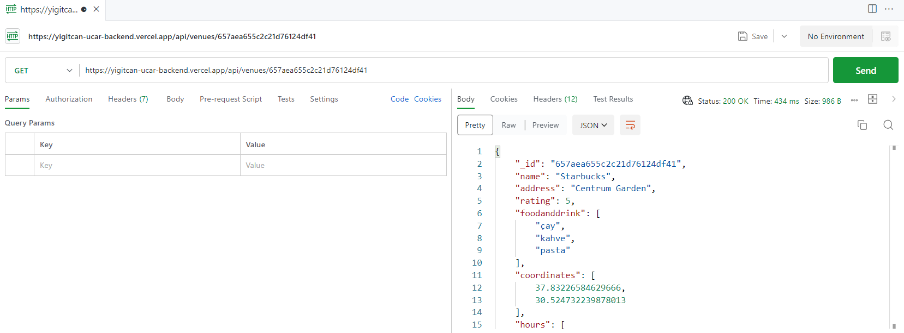

# MongoDB ile Backend Projesi

Bu proje, MongoDB veritabanını kullanarak basit bir backend uygulamasını içermektedir.

## 1. KONUMA GÖRE MEKAN LİSTELEME: https://yigitcan-ucar-backend.vercel.app/api/venues?lat=1&long=1

## 2. ID'YE GÖRE MEKAN GETİR: https://yigitcan-ucar-backend.vercel.app/api/venues/657aea655c2c21d76124df41

## 3. ID'YE GÖRE YORUM GETİR: https://yigitcan-ucar-backend.vercel.app/api/venues/657aea655c2c21d76124df41/comments/65844481464121feea044602
